## High Level Design:

Data Ingestion: The first step is to ingest the data from the e-commerce platform into Databricks. This could be done using Databricks' built-in connectors for various data sources.

Data Processing: Once the data is ingested, it needs to be processed. This could involve cleaning the data, transforming it into a suitable format, and extracting useful features. This can be done using Databricks' support for Apache Spark, which allows for distributed data processing.

Data Storage: After processing, the data should be stored in a suitable format for analysis. This could be a data lake, a data warehouse, or a database, depending on the needs of the business. Databricks has built-in support for various storage options, including Azure Data Lake Storage, Amazon S3, and others.

Data Analysis: The processed data can then be analyzed to provide valuable insights. This could involve creating dashboards, running ad-hoc queries, or building machine learning models. Databricks provides a unified analytics platform that allows for all of these.

Data Visualization: Finally, the results of the analysis should be visualized in a way that is easy for business stakeholders to understand. This could be done using Databricks' built-in visualization tools, or by integrating with other tools like Power BI or Tableau.

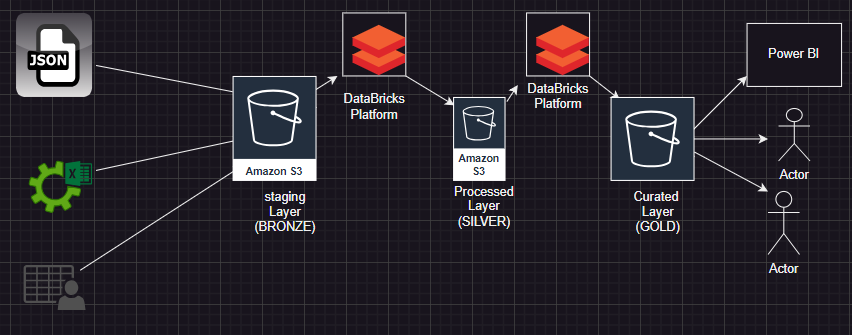

Running a DataBricks cluster on AWS - setup

## Tasks:

### 01. Create raw tables for each source dataset:

Strategy adopted for extraction is to use a python script to upload the raw data on an S3 Object Store.
[Link to the code](./data_extraction/)
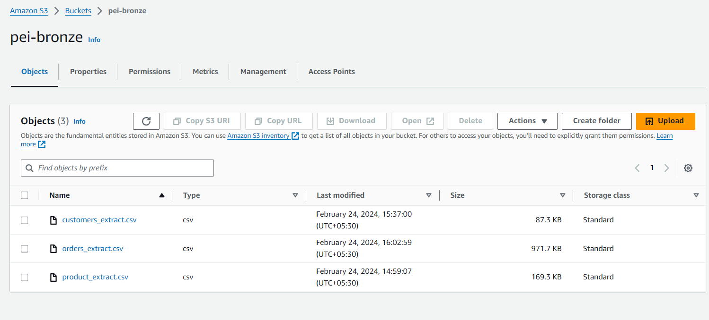

Followed by creating External Tables in Spark catalog
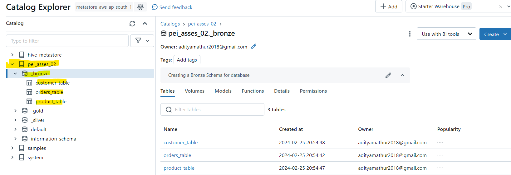
[Link to the code](./notebooks/01.create_external_tables.ipynb)

##### Customers:

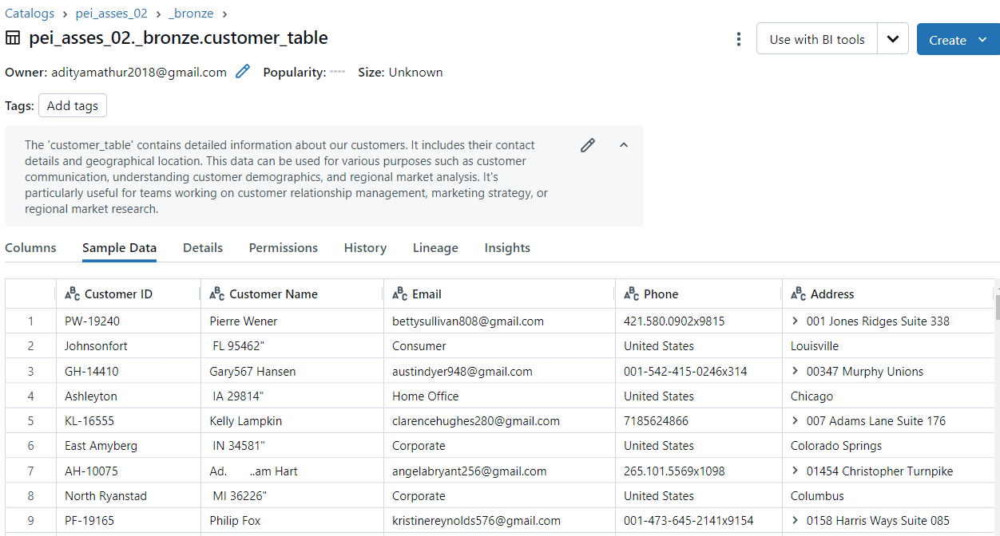
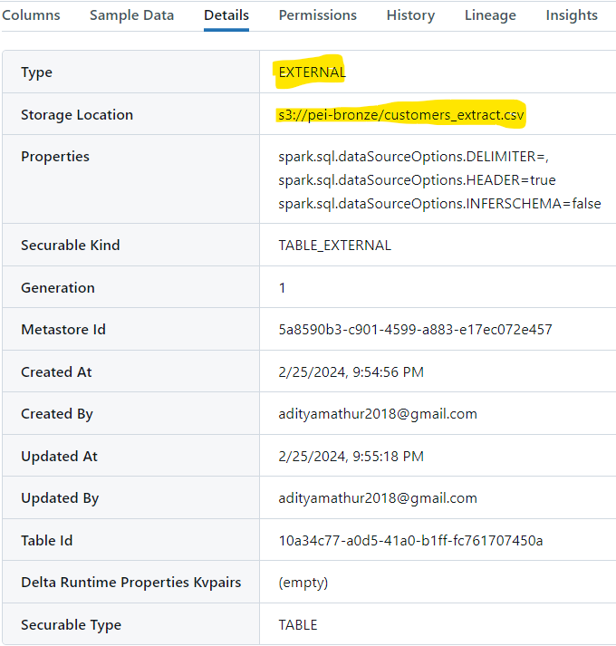

##### Products:

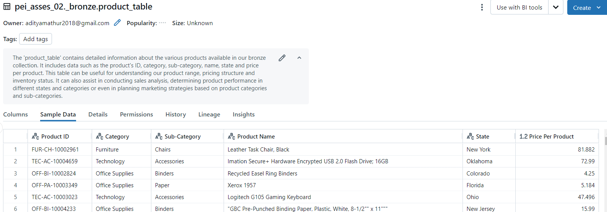
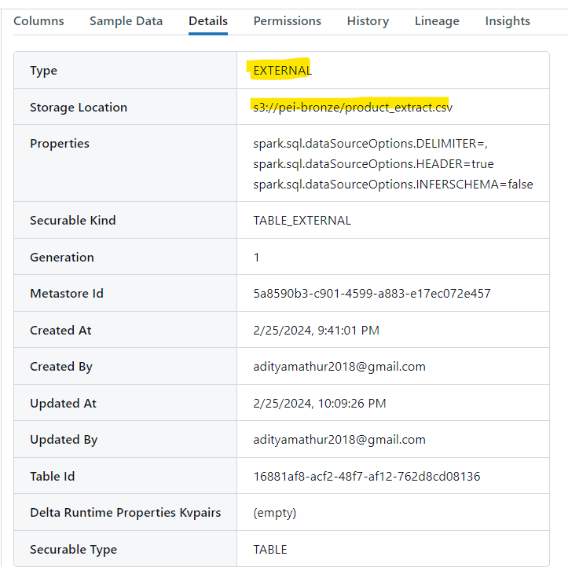

##### Orders:

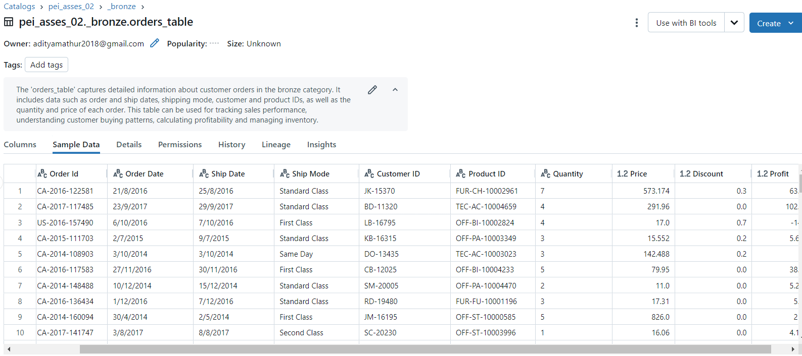
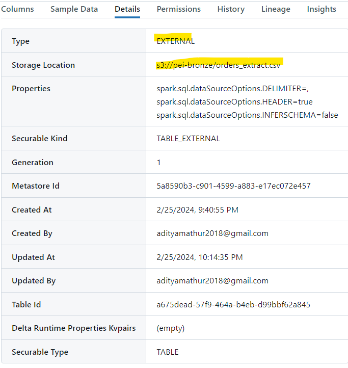
### 02. Create an enriched table for customers and products

[Link to the code](./notebooks/02.enrich%20customer%20&%20product%20table.ipynb)
    
 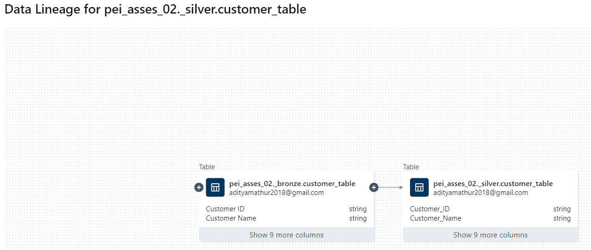
 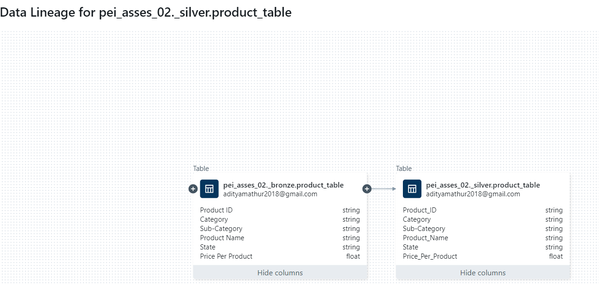
 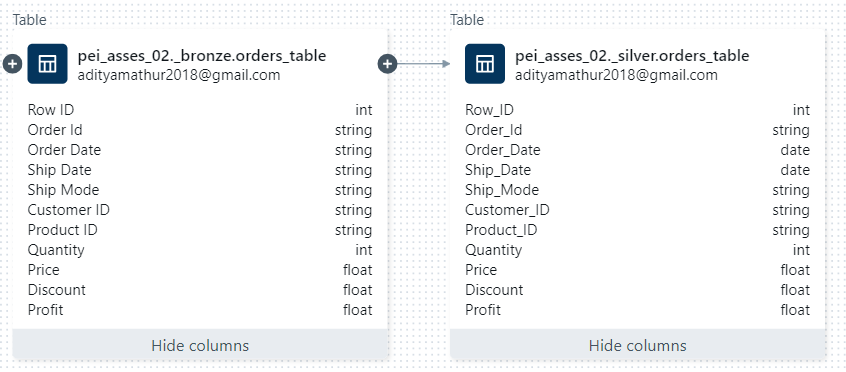
 
### 03. Create an enriched table which has

Creating curated table using the enriched data in step 2.
Using Pyspark DataFrame APIs

    - order information 
        - Profit rounded to 2 decimal places
    - Customer name and country
    - Product category and sub category

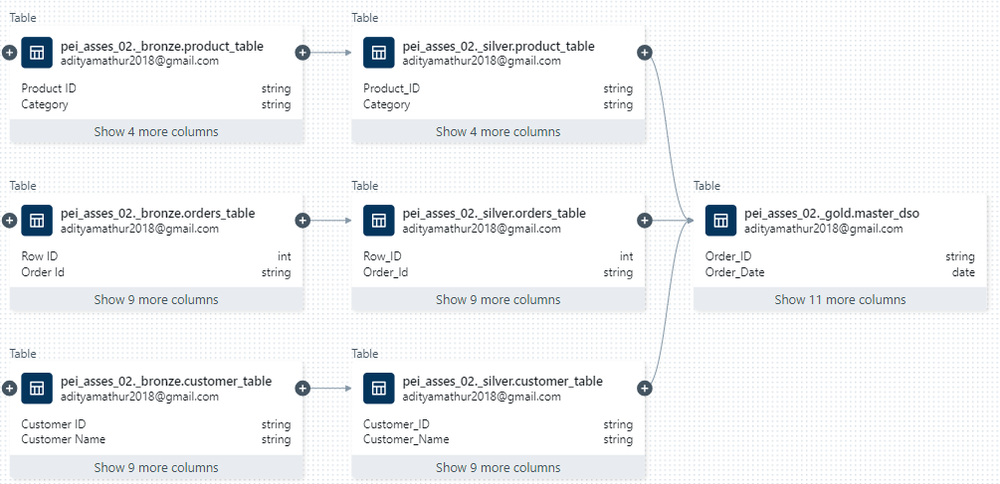

### 04. Create an aggregate table that shows profit by

For this task, I am using the curated table created in Step 3.
and using pyspark DataFrame API created aggregate tables.

[Link to the code](./notebooks/04.Aggregate_Tables.ipynb)

    - Year

 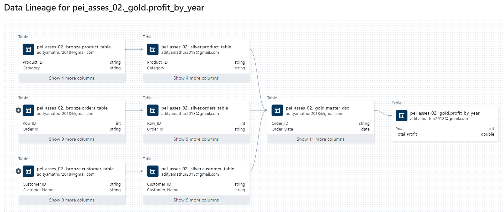

    - Product Category

 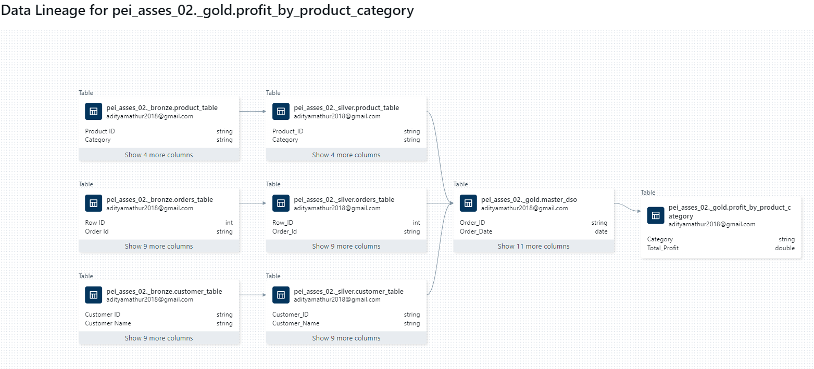

    - Product Sub Category

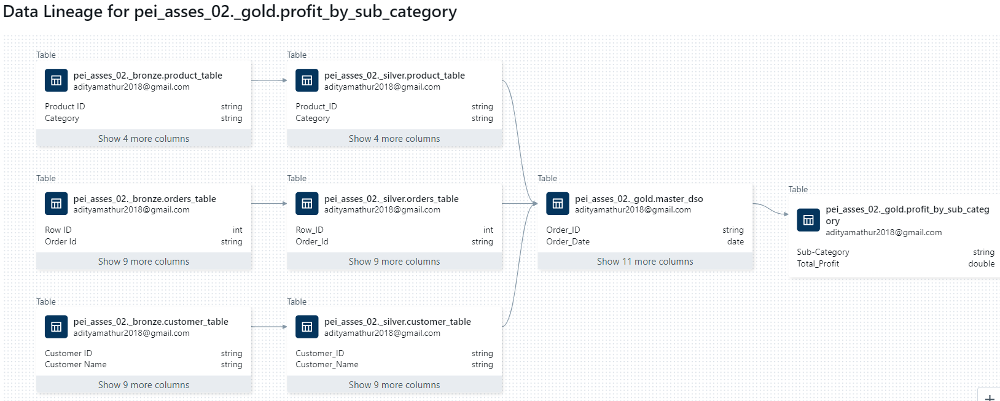

    - Customer
 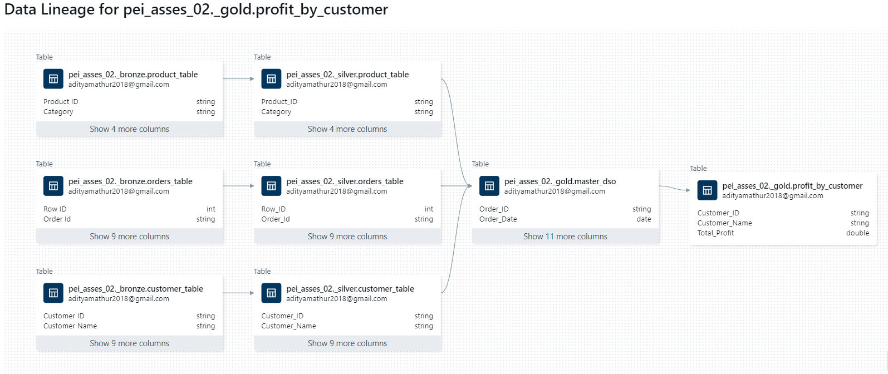

### 05. Using SQL output the following aggregates

Using table created in previous task and SQL endpoint editor to run the queries

    - Profit by Year

 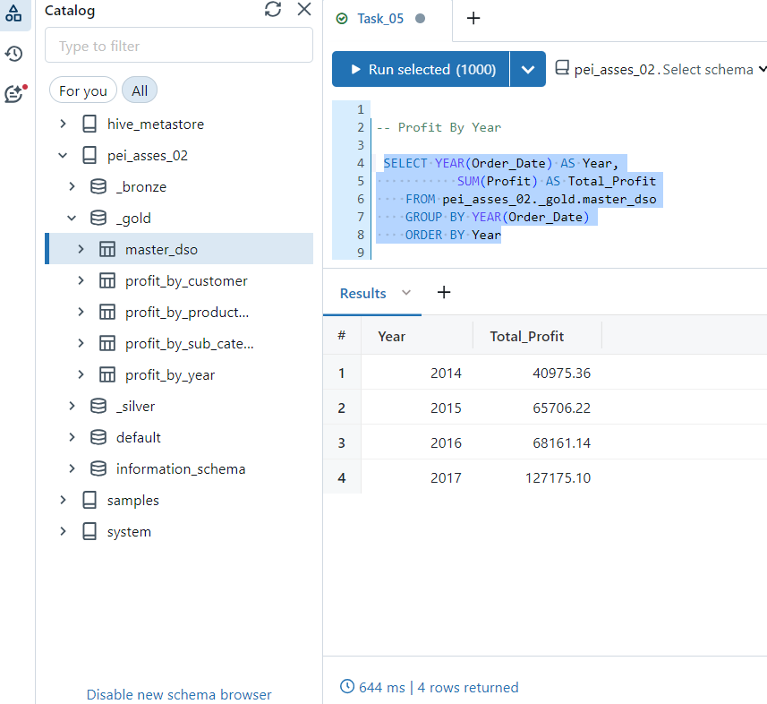

    - Profit by Year + Product Category

 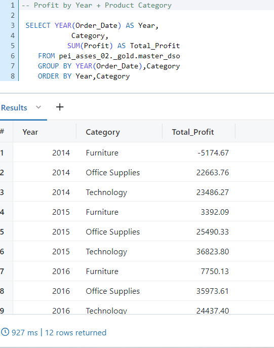

    - Profit by Customer

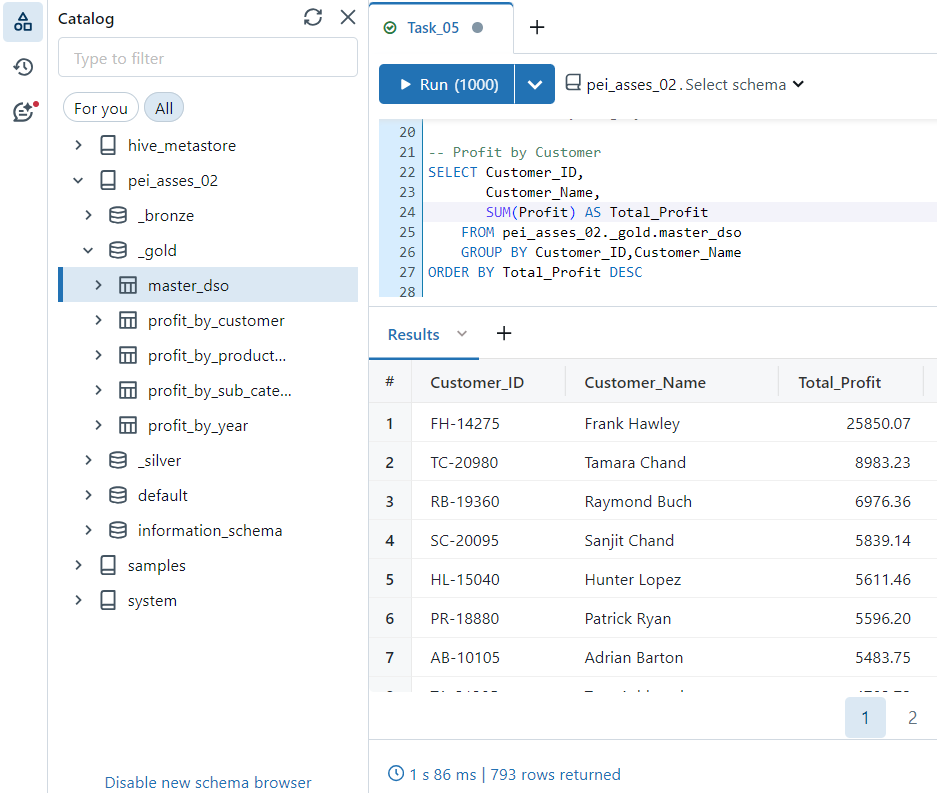

    - Profit by Customer + Year

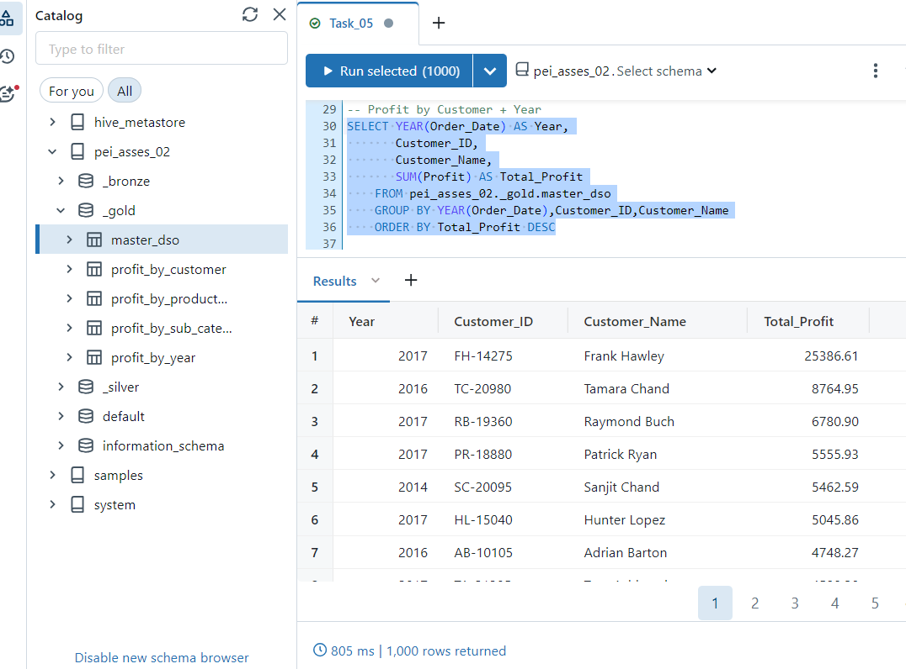

## Adding Test Suite:

for the modules used in extraction and transformation pipelines, tests to verify the reliability of functions is included in project's pipeline_test module.

[Link to the code module](./pipeline_test)

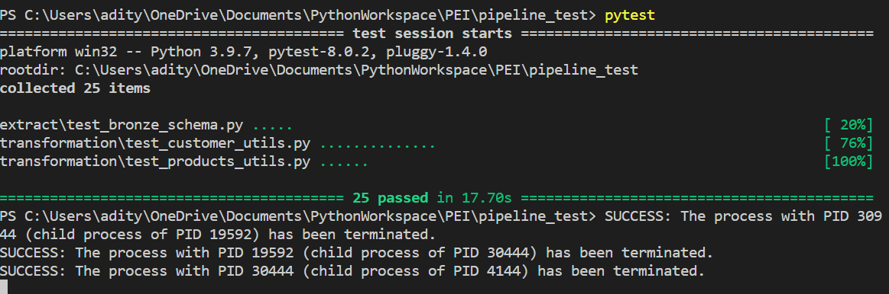

## Conclusion:
This project showcases a comprehensive data pipeline implemented in Databricks, covering data ingestion, processing, storage, analysis, and visualization. By leveraging Databricks' powerful capabilities and integration with various data sources and tools, it enables efficient and scalable data workflows for actionable insights and decision-making.
The adherence to Test-Driven Development (TDD) principles ensures the reliability and correctness of the implemented functionality, providing confidence in the project's outcomes.